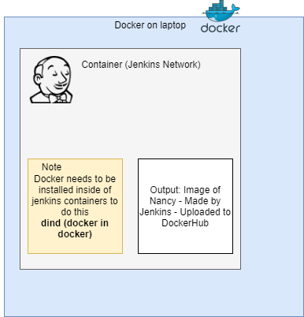
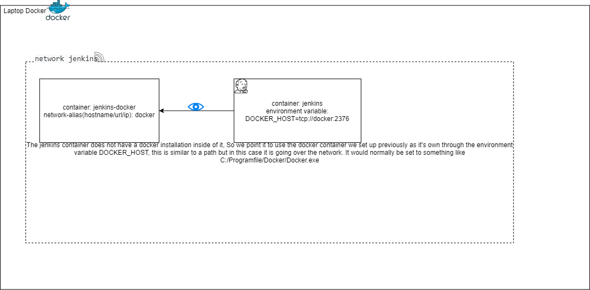

from https://www.jenkins.io/doc/book/installing/docker/

Open CMD




Run jenkins in docker

`docker network create jenkins`

run a container from jenkins docker image - dind (docker in docker)
	
```
docker run --name jenkins-docker --rm --detach ^
  --privileged --network jenkins --network-alias docker ^
  --env DOCKER_TLS_CERTDIR=/certs ^
  --volume jenkins-docker-certs:/certs/client ^
  --volume jenkins-data:/var/jenkins_home ^
  docker:dind
```

Explained
- `rm` - Delete container when finished
- `detach` - run in background, so i can write on cl but container is running
- `privileged` - admin login 
- `network` - running on jenkins like wifi 
-  `env` - environment variables
-  `volume` - maps windows locations to container locations. so when the container deletes data isnt lost 
 




